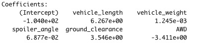

# MechaCar_Statistical_Analysis

## Linear Regression to Predict MPG

- Which variables/coefficients provided a non-random amount of variance to the mpg values in the dataset?
    - In the summary output, each Pr(>|t|) value represents the probability that each coefficient contributes a random amount of variance to the linear model. According to our results, vehicle_length and ground_clearance (as well as intercept) are statistically to provide non-random amounts of variance to the linear model. In other words the vehicle_length and ground_clearance have a significant impact on the mpg.

- Is the slope of the linear model considered to be zero? Why or why not?
    - The p-value of our linear regression analysis is 5.35e-11, which is much smaller than our assumed significance level of 0.05%. Therefore, we can state that there is sufficient evidence to reject our null hypothesis, which means that the slope of our linear model is not zero.

- Does this linear model predict mpg of MechaCar prototypes effectively? Why or why not?
    - The R-squared is 0.7149, which means that roughly 71.49% of the variablity of our dependent variable is explained using this liner model. In details, 71% of the variations in mpg can be explained by changes in the vehicle length, the vehicle weight, the spoiler angle, the drivetrain and the ground clearance. Therefore, we could consider this liner model predict mpg of MechaCar prototypes effectively.

## Summary Statistics on Suspension Coils

- The design specifications for the MechaCar suspension coils dictate that the variance of the suspension coils must not exceed 100 pounds per square inch. Does the current manufacturing data meet this design specification for all manufacturing lots in total and each lot individually? Why or why not?
    - In General, the current manufacturing data meet this design specification for all manufacturing lots, since the global variance is 62.29356 PSI which is less than 100 PSI pounds.
    - For each lot individually, lot 1 and lot 2 meet this design specification, with variances of 0.9795918 PSI and 7.4693879 PSI, which are pretty good.
    - For lot 3, the variance is 170.2861224 PSI, which is higher than 100 PSI. It means that does not meet this design specification.

## T-Tests on Suspension Coils

- Summary and Findings
    - The p-value for all lots is 0.0628 which is higher than 0.05. Therefore, we fail to reject null hypothesis, which means there is not statistically significant and indicates strong evidence for the null hypothesis.
    - The p-value for lot 1 is 1 which is higher than 0.05. Therefore, we fail to reject null hypothesis, which means there is not statistically significant and indicates strong evidence for the null hypothesis.
    - The p-value for lot 2 is 0.6072 which is higher than 0.05. Therefore, we fail to reject null hypothesis, which means there is not statistically significant and indicates strong evidence for the null hypothesis.
    - The p-value for lot 3 is 0.04168 which is less than 0.05. Therefore, we reject null hypothesis, which means there is statistically significant and indicates strong evidence for the null hypothesis.

## Study Design: MechaCar vs Competition

- When it comes to design for comparing the MecharCar to its competition, the company could use statisitical test to compare in various categories. The example that costomers would like to consider are cost, city highway fuel efficiency, hourse power, maintenance cost or safty rating. 
    - What metric or metrics are you going to test?
        - Dependent variable: Cost
        - Independent variables: city highway fuel efficiency, hoursepower, maintenance cost and safty rating. 
    - What is the null hypothesis or alternative hypothesis?
        - null hypothesis: MechaCar's price is designed based on its performance of preview independent variables.
        - alternative hypothesis: MechaCar's price is not designed based on its performance of preview independent variables.
    - What statistical test would you use to test the hypothesis? And why?
        - A multiple linear regression would be used to determine the cost with correlation/predictability. 
    - What data is needed to run the statistical test?
        - The data about city highway fuel efficiency, hourse power, maintenance cost and safty rating about cars is needed.